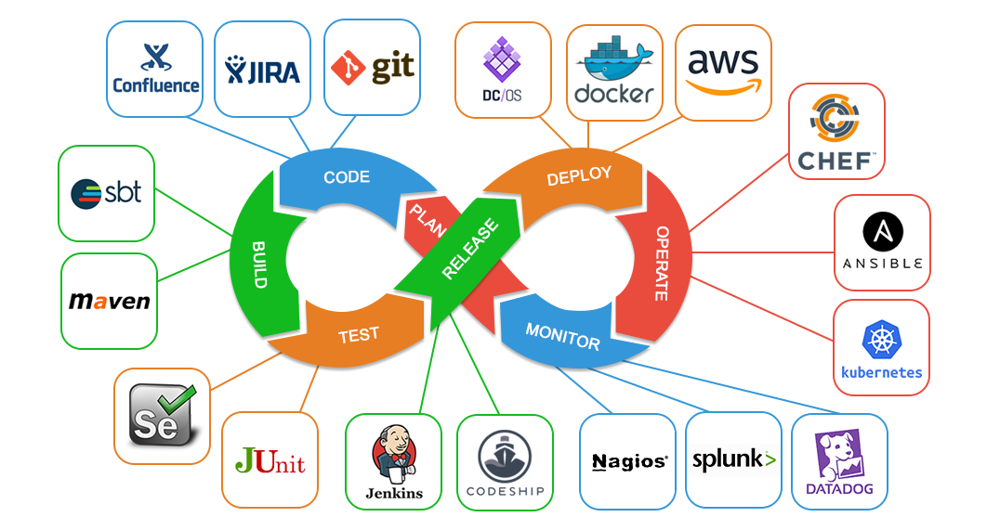
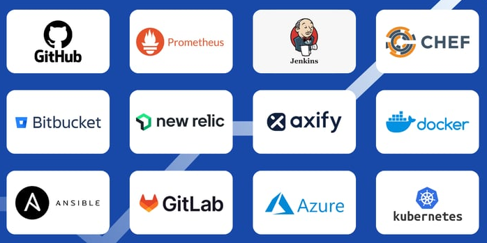
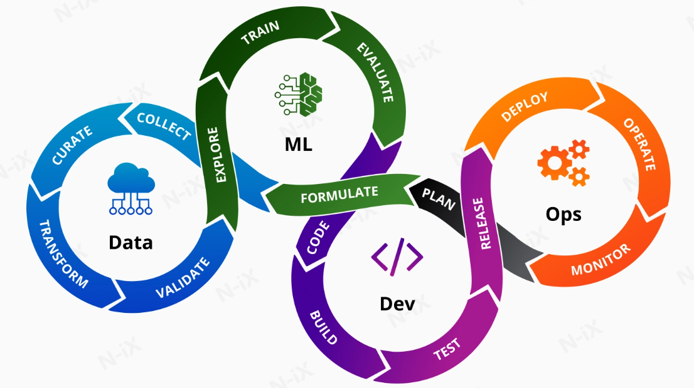
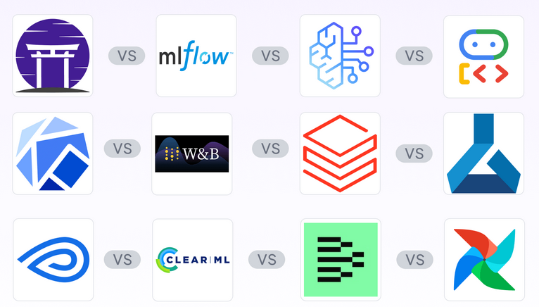

# Software Development Life Cycle (SDLC) Exercise

Common Roles in SDLC
- Developer
- DevOps
- MlOps
- SRE

---

# Developer Role

## Pre-requisites
- Ubuntu
- Install NodeJS and NPM
    ```bash
    sudo apt update && sudo apt install nodejs npm
    ```
- Install Python
  ```bash
  sudo apt update && apt install python3
  ```
- Install Docker
    - Follow instructions from here: https://docs.docker.com/engine/install/ubuntu/


## Development

### Clone Repository
```bash
git clone https://github.com/dihajum/devops-workshop.git
```

### Install Dependencies
```bash
cd angular-landing-page
npm install
```

### Starting application
```bash
npm run start
```

### Building application
```bash
npm run build
```

### Serving Application
```bash
python3 -m http.server -d dist
```

### Build Container Imge
```bash
docker build -t myapp -f ../dockerfile-raw .
```

### Build Optimized Container Image
```bash
docker build -t myapp-opt -f ../dockerfile-optimized .
```

### Running application from container
```bash
docker run -it --rm -p 80:80 myapp

# Run as a service (Optimized Image)
docker run -d --restart=unless-stopped -p 80:80 --name myapp myapp-opt
```

---

# DevOps Role

Common responsibilities include:
- Infrastructure Management
- Deployment
- Automation
- CI/CD Pipeline Management
- Monitoring / Logging



Popular DevOps Tools


## Github Actions

- CI/CD Platform for automating software development workflows
- Built-in to Github
- Workflows are written in YAML file
- Workflow is run in a pre-configured node called runner

Sample github actions workflow file
```yaml
# Triggers Definitions
on:
  push:
    branches:
    - main

# Pipeline Definitions
jobs:
  build:
    runs-on: self-hosted
    steps:
      - name: Clone Repository
        uses: actions/checkout@v6
      - name: Build App Container
        run: |
          cd src
          docker build -t image .

```

---

# MLOps Role

Common responsibilities includes:
- Data preparation and featurization
- Continuous Training
- Model tracking and deployment



Popular MLOps Tools


## MlFlow

### Pre-requisites
- Python

### Installing mlflow
```bash
pip install mlflow

# OPTIONAL: If you are facing issue with pip install,
# create virtual environemnt before pip command
python -m venv .venv
source .venv/bin/activate

```

### Starting MLFlow UI
```bash
mlflow ui

# Access UI at http://127.0.0.1:5000
```
